# Beispiel: Schutzwald Katzberg

::: details Lage
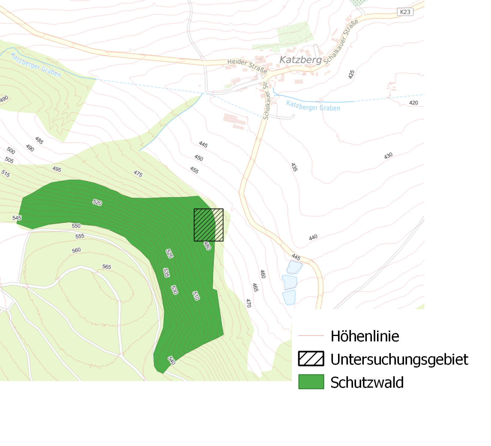
:::

::: info
Bitte starte die Conda-Konsole und aktiviere die PDAL Umgebung bevor du mit dem Beispiel beginnst.

```bash
conda activate pdal
```

Wechsle anschließend mit 'cd' in das WS-Verzeichnis.
  
:::

## 1. Merge

Vereinigen aller Dateien mit der Endung `2014.laz` im WS-Verzeichnis

::: details Pipeline e01_merge.json
@[code](./e01_merge.json)
:::

::: details Aufruf

```bash
pdal pipeline e01_merge.json
```

:::

## 2. Crop

Beschneiden der Datei `merge2014.laz` auf ein Rechteck: P~LL~(640007;5583845), P~UR~(640087;5583934)

::: details Pipeline e02_crop.json
@[code](./e02_crop.json)
:::

::: details Aufruf

```bash
pdal pipeline e02_crop.json
```

:::

## 3. 3D-Map View

Betrachte die Datei `crop2014.laz` in QGIS

1. QGIS starten
2. Projekt als 'pdal-ws' im WS-Ordner speichern
3. Datei `crop2014.laz` zur Karte hinzufügen
4. Layer Properties aufrufen
5. Tab Symbology aufrufen
6. Dialog zeigt die Klassifikation nach Classification Attribut
   ::: details
   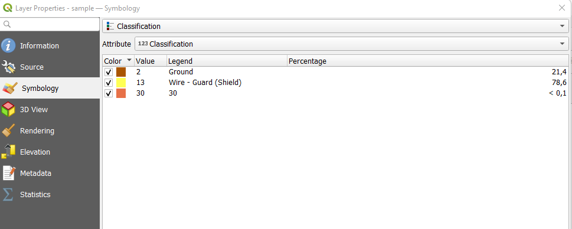
   :::
7. Tab: Stats aufrufen
8. Dialog zeigt die Attribute und Classification Statistik
   ::: details
   
   :::
9. Neue 3D Kartenansicht anlegen mit Menu 'View/3D Map Views/New 3D Map View'
10. 3D Map View zeigt Layer
11. Configuration öffnen
12. Shadows aktivieren  
    ::: details
      
    :::

13. Navigation: Zoom in/out über Maus-Wheel-Rad
14. 3D Map view zeigt LAS mit Schatten
  ::: details
    
   :::

::: info
Um das Handling von großen Point Cloud Daten zu verbessern, erzeugt QGIS beim erstmaligen Lesen einer LAS/LAZ Datei eine [Cloud Optimized Point Cloud Datei](https://mapscaping.com/cloud-optimized-point-clouds-in-qgis/) mit der Endung `.copc.laz` im Verzeichnis der Originaldatei. Falls sich die Originaldatei ändert, muss der Cache manuell gelöscht werden.
:::

::: info
Weitere Möglichkeiten zur Darstellung von 3D-Daten werden im QGIS-Handbuch erläutert:

- [Working with Point Clouds](https://docs.qgis.org/3.28/en/docs/user_manual/working_with_point_clouds/point_clouds.html#)
- [3D Map View](https://docs.qgis.org/3.28/en/docs/user_manual/map_views/3d_map_view.html)
:::

## 4. Punktdichtekontrolle

Erzeugen eines Hex-Bin Vektor-Layers zur Dichtekontrolle mit Hilfe der Density Anwendung

a. Rufe die Hilfe zur `pdal density` Anwendung auf
::: details Aufruf

```bash
pdal density --help
```

:::

b. Erzeuge einen GeoJSON Hex-Bin Density Layer mit 5m Kantenlänge
::: details Aufruf

```bash
pdal density --lyr_name density --ogrdriver GeoJSON --edge_length 5 crop2014.laz crop2014hex5.geojson
```

:::

c. Öffne QGIS und erzeuge eine 'Graduated Symbology Legend' auf dem Feld 'crop2014hex5.count' mit der Klassifizierungsmethode 'Natural Breaks (Jenks)' und sieben Werteklassen

::: details QGIS Karte
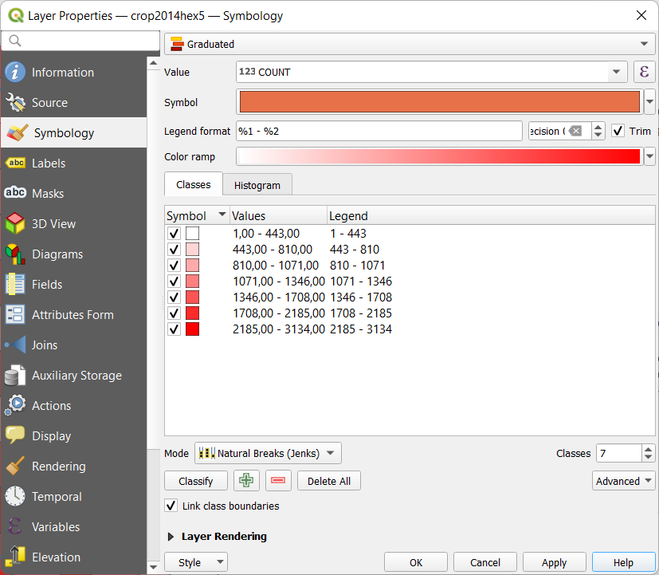

:::

## 5. Eliminieren von Ausreißern

Löschen von Punkten mit einer Höhe < 450m

::: details Pipeline e05_outlier.json
@[code](./e05_outlier.json)
:::

::: details Aufruf

```bash
pdal pipeline e05_outlier.json
```

:::

::: note
Eine weitere Möglichkeit zur Detektion und Klassifizierung von Punkten mit niedrigen Höhen ist die Anwendung des ELM Filters nach Chen.  
 [filters.elm](https://pdal.io/en/latest/stages/filters.elm.html)
:::

## 6. Categorized Symbology

Lade die Datei `classification.geojson` in QGIS und erzeuge eine 'Categorized Symbology' auf dem Feld 'name'
::: details QGIS Karte
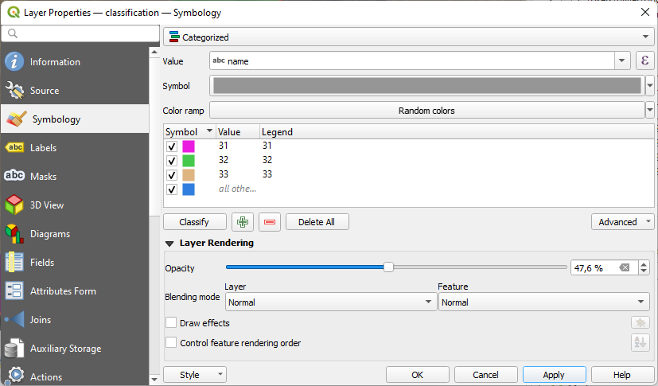

:::

## 7. Vector Overlay mit Filter

Pipeline  
 a. Overlay von `crop2014g.laz` mit dem Polygon aus der Datei `classification.geojson`  
 b. Extraktion aller Punkte innerhalb der Schutzwälder: `(Classification==33)`

::: details Pipeline e07_overlay_expression.json
@[code](./e07_overlay_expression.json)
:::

::: details Aufruf

```bash
pdal pipeline e07_overlay_expression.json
```

:::


::: details QGIS Karte
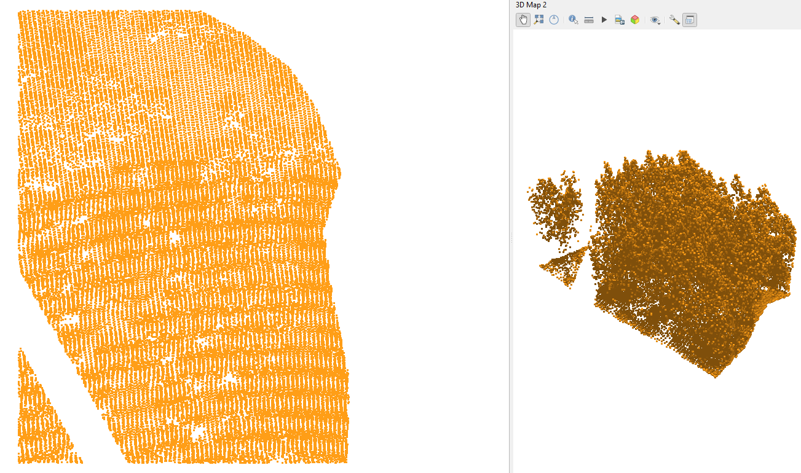
:::

## 8. Ground Klassifikation

Pipeline 
- Reset der Classification Dimension mit [filters.assign](https://pdal.io/en/latest/stages/filters.assign.html)  
- Klassifizierung der Ground Points mit [filters.smrf](https://pdal.io/en/latest/stages/filters.smrf.html)  
- Reduzieren der Ausgabepunkte auf die Ground-Points (Classification==2) mit [filters.expression](https://pdal.io/en/latest/stages/filters.smrf.html)  
- Schreibe LAS-Datei

::: details Pipeline e08_ground.json
@[code](./e08_ground.json)
:::

::: details Aufruf

```bash
   pdal pipeline e08_ground.json
```

:::

::: details QGIS Karte

:::

## 9. DGM

### 9.1 Direkter Export

a. GDAL-Export
::: details Aufruf

```bash
pdal translate ground2014g.laz ground2014g.tif --writers.gdal.resolution=0.5
```

:::

b. Anzeige in QGIS
::: details Karte mit NODATA Lücken
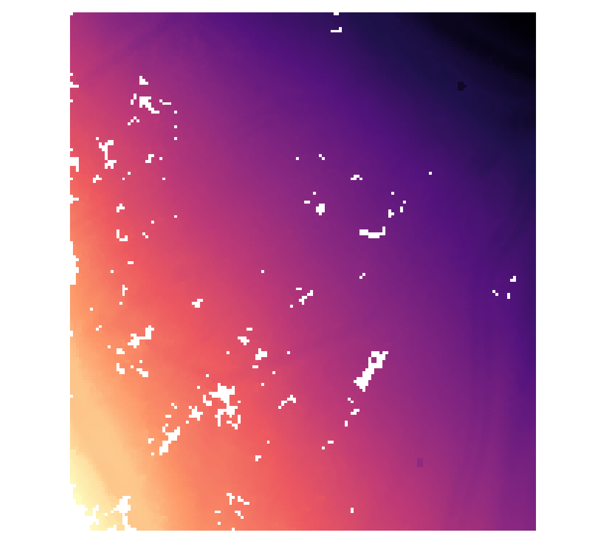
:::

c. Füllen der NODATA Werte über Interpolation in QGIS
::: details Dialog Raster/Analysis/Fill nodata
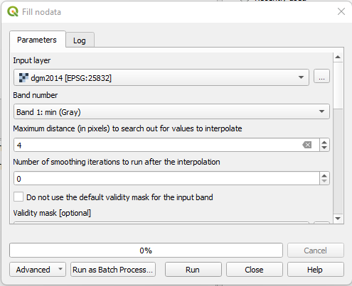
:::

d. Kontrolle in QGIS
::: details
Karte ohne NODATA Lücken
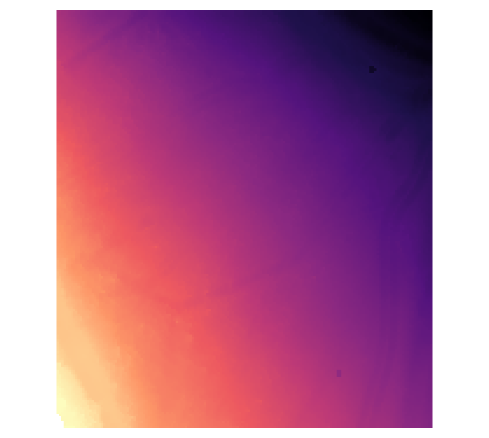

3D Map View  
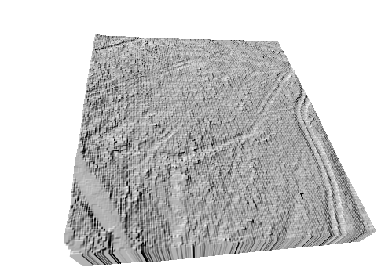
:::

### 9.2 Triangulation

Pipeline aus [fiters.delaunay](https://pdal.io/en/latest/stages/filters.delaunay.html), [filters.faceraster](https://pdal.io/en/latest/stages/filters.faceraster.html) und [writers.raster](https://pdal.io/en/latest/stages/writers.raster.html)

::: details Pipeline e09_tin.json
@[code](./e09_tin.json)
:::

::: details Aufruf

```bash
pdal pipeline e09_tin.json
```

:::

::: details QGIS Karte
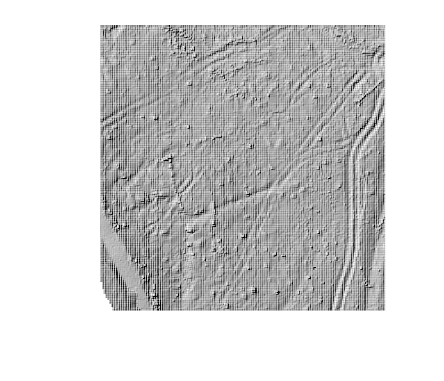
:::

## 10. Baum Klassifikation und Analyse

Klassifikation der Bäume in einer Pipeline aus [filters.hag_delaunay](https://pdal.io/en/latest/stages/filters.hag_delaunay.html), [filters.sort](https://pdal.io/en/latest/stages/filters.sort.html),
[filters.litree](https://pdal.io/en/latest/stages/filters.litree.html),[filters.expression](https://pdal.io/en/latest/stages/filters.expression.html) und [writers.las](https://pdal.io/en/latest/stages/writers.las.html)

::: details Pipeline e10_tree.json
@[code](./e10_tree.json)
:::

::: details Aufruf
```bash
# Achtung: Die Berechnung dauert ca. 2 min. bis ca. 150 Bäume erkannt werden ....
pdal -v 8 pipeline e10_tree.json
```
:::

::: details QGIS 
2D Karte  
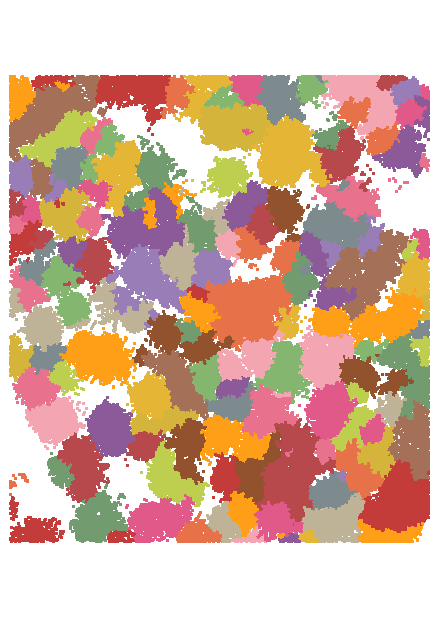  
3D View   
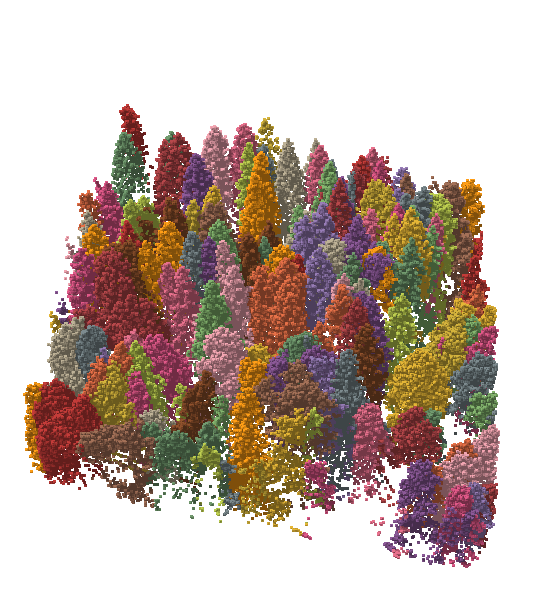
:::

Pipeline zur Berechnung der maximalen Höhe über Grund für jeden Baum. Die Pipeline verwendet [filters.python](https://pdal.io/en/latest/stages/filters.python.html) zur Ermittlung der Höhe und schreibt das Ergebnis über [writers.ogr](https://pdal.io/en/latest/stages/writers.ogr.html) in eine GeoJSON-Datei.

::: details Pipeline e10_tree_stats.json
@[code](./e10_tree_stats.json)
:::


::: details Python Datei `lib.py` 
@[code](./lib.py)
:::

::: details Aufruf
```bash
pdal pipeline e10_tree_stats.json
```
:::

::: details QGIS

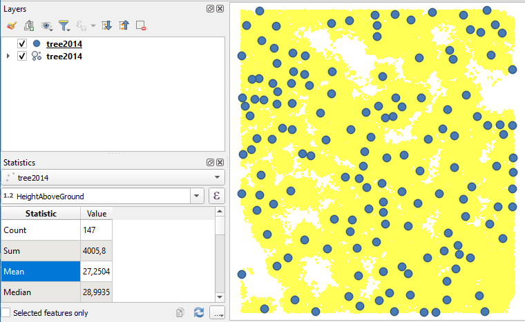

:::


## 11. DOP als RGB Farbwert
Zuweisen von Farbwerten aus einer Raster-Datei mit [filters.colorization](https://pdal.io/en/latest/stages/filters.colorization.html)

::: details Pipeline e11_dop.json
@[code](./e11_dop.json)
:::

::: details Aufruf
```bash
pdal pipeline e11_dop.json
```
:::

::: details QGIS 3D View
3D View   
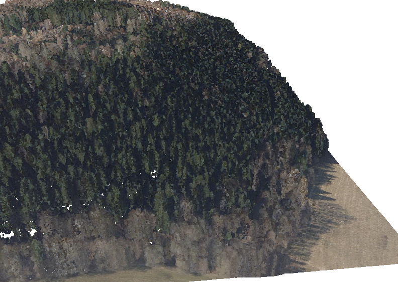
:::

## 12. Schutzwalddarstellung 

Skalieren von Farbwerten mit Hilfe von [filters.assign](https://pdal.io/en/latest/stages/filters.assign.html)

::: details Pipeline e12_dop_sample.json
@[code](./e12_dop_sample.json)
:::

::: details Aufruf
```bash
pdal pipeline e12_dop_sample.json
```
:::

::: details 3D View   
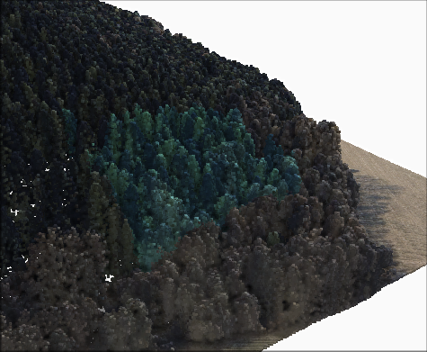
:::