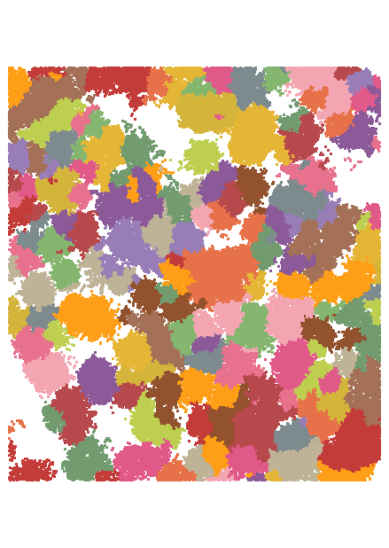
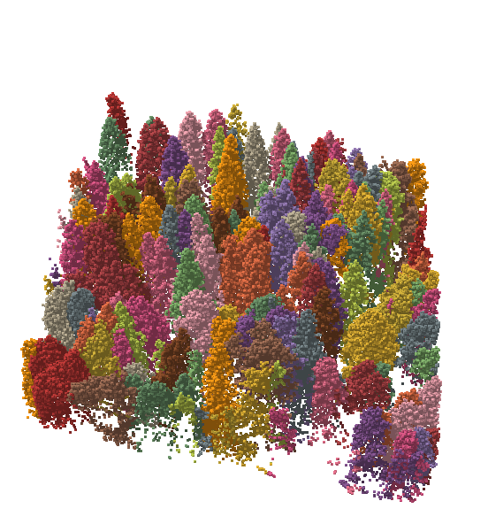

# Beispiel: Schutzwald Katzberg

::: details Lage

:::

::: info
Bitte starte die Conda Console und aktiviere die PDAL Umgebung bevor du mit dem Beispiel beginnst.

```bash
conda activate pdal
```

Wechsle anschließend mit 'cd' in das WS-Verzeichnis.  
:::

## 1. Merge

Pipeline

- Input: alle Dateien mit der Endung \*2014.laz im WS-Verzeichnis
- Output: Datei 'merge2014.laz'

::: details Pipeline e1_merge.json
@[code](./e1_merge.json)
:::

::: details Aufruf

```bash
pdal pipeline e1_merge.json
```

:::

## 2. Crop

Beschneiden der Datei merge2014.laz auf die rechteckige Grenze des Untersuchungsgebietes: LL(640007;5583845), UR(640087;5583934)

::: details Pipeline e2_crop.json
@[code](./e2_crop.json)
:::

::: details Aufruf

```bash
pdal pipeline e2_crop.json
```

:::

## 3. 3D-Map View

Betrachte die Datei `crop2014.laz` in QGIS

1. QGIS starten
2. Projekt als 'pdal-ws' im WS-Ordner speichern
3. Datei `crop2014.laz` zur Karte hinzufügen
4. Layer Properties aufrufen
5. Tab Symbology aufrufen
6. Dialog zeigt die Standard Klassifikation nach Classifaction Attribut
   ::: details
   
   :::
7. Tab: Stats aufrufen
8. Dialog zeigt die Attribute und Classification Statistik
   ::: details
   
   :::
9. Neue 3D Kartenansicht anlegen mit Menu 'View/3D Map Views/New 3D Map View'
10. 3D Map View zeigt Kartenlayer
11. Configuration öffnen
12. Shadows aktivieren  
    ::: details
      
    :::

- Navigation: Zoom in/out über Wheel-Rad
- 3D Map view zeigt LAS mit Schatten
  ::: details
    
   :::

::: info
Um das Handling von großen Point Cloud Daten zu verbesseren, erzeugt QGIS beim erstmaligen Lesen einer LAS/LAZ Datei eine sog. [Cloud Optimized Point Cloud Datei](https://mapscaping.com/cloud-optimized-point-clouds-in-qgis/) mit der Endung '\*.copc.laz' im Verzeichnis der Originaldatei. Sie dient als Cache und muss zur Zeit noch manuelle gelöscht werden, falls die Originaldatei geändert wird.
:::

::: info
Falls du mehr über die Möglichkeiten zur Darstellung von 3D Daten in QGIS Wissen möchtest, hilft ein Blick in das QGIS Manual:

- [Working with Point Clouds](https://docs.qgis.org/3.28/en/docs/user_manual/working_with_point_clouds/point_clouds.html#)
- [3D Map View](https://docs.qgis.org/3.28/en/docs/user_manual/map_views/3d_map_view.html)
  :::

## 4. Punktdichtekontrolle

Erzeugen eines Hex-Bin Vektor-Layers zur Dichtekontrolle

a. Rufe die Hilfe zur `pdal density` Anwendung auf
::: details

```bash
pdal density --help
```

:::

b. Erzeuge einen GeoJSON Hex-Bin Density Layer mit 5m Kantenlänge
::: details

```bash
pdal density --lyr_name density --ogrdriver GeoJSON --edge_length 5 crop2014.laz crop2014hex5.geojson
```

:::

c. Öffne QGIS und erzeuge eine 'Graduated Symbology Legend' auf dem Feld 'crop2014hex5.count' mit der Klassifizierungsmethode Natural Breaks (Jenks) und sieben Werteklassen

::: details QGIS Karte


:::

## 5. Eleminieren von Ausreißern

Löschen von Punkten mit einer Höhe < 450m

::: details Pipeline e5_outlier.json
@[code](./e5_outlier.json)
:::

::: details Aufruf

```bash
pdal pipeline e5_outlier.json
```

:::

::: note
Eine weitere Möglichkeit zur Detektion und Klassifizierung von Punkten mit niedrigen Höhen ist die Anwendung des ELM Filters nach Chen.  
 [filters.elm](https://pdal.io/en/latest/stages/filters.elm.html)
:::

## 6. Categorized Symbology

Lade die Datei `classification.geojson` in QGIS und erzeuge eine 'Categorized Symbology' auf dem Feld 'name'
::: details QGIS Karte


:::

## 7. Vector Overlay mit Filter

Pipeline:  
 a. Overlay von crop2014g.laz mit dem Polygon aus der Datei 'classification.geojson'  
 b. Extraktion aller Punkte innerhalb der Schutzwälder (Classification==33)

::: details Pipeline e7_overlay_expression.json
@[code](./e7_overlay_expression.json)
:::

::: details Aufruf

```bash
pdal pipeline e7_overlay_expression.json
```

:::

c. Ergebnis in QGIS
::: details QGIS Karte

:::

## 8. Ground Klassifikation

Pipeline:  
a. Reset der Classification Dimension mit [filters.assign](https://pdal.io/en/latest/stages/filters.assign.html)  
b. Klassifizierung der Ground Points mit [filters.smrf](https://pdal.io/en/latest/stages/filters.smrf.html)  
c. Reduzieren der Ausgabepunkte auf die Ground-Points (Classification==2) mit [filters.expression](https://pdal.io/en/latest/stages/filters.smrf.html)  
d. Schreibe LAS-Datei

::: details Pipeline e8_ground.json
@[code](./e8_ground.json)
:::

::: details Aufruf

```bash
   pdal pipeline e8_ground.json
```

:::

Betrachte die Ground Datei in QGIS:
::: details Karte

:::

## 9. DGM

### 9.1 Direkter Export

a. GDAL Export
::: details Aufruf

```bash
pdal translate ground2014g.laz ground2014g.tif --writers.gdal.resolution=0.5
```

:::

b. Anzeige in QGIS
::: details Karte mit NODATA Lücken

:::

c. Füllen der NODATA Werte über Interpolation in QGIS
::: details Dialog Raster/Analysis/Fill nodata

:::

d. Kontrolle in QGIS
::: details
Karte ohne NODATA Lücken


3D Map View  

:::

### 9.2 Triangulation

a. Pipeline aus [fiters.delaunay](https://pdal.io/en/latest/stages/filters.delaunay.html), [filters.faceraster](https://pdal.io/en/latest/stages/filters.faceraster.html) und [writers.raster](https://pdal.io/en/latest/stages/writers.raster.html)
::: details e92_tin.json
@[code](./e92_tin.json)
:::

b. Aufruf
::: details

```bash
pdal pipeline e92_tin.json
```

:::

c. Kontrolle in QGIS

::: details Karte

:::

## 10. Baum Klassifikation

a. Pipeline aus [filters.hag_delaunay](https://pdal.io/en/latest/stages/filters.hag_delaunay.html), [filters.sort](https://pdal.io/en/latest/stages/filters.sort.html),
[filters.litree](https://pdal.io/en/latest/stages/filters.litree.html),[filters.expression](https://pdal.io/en/latest/stages/filters.expression.html) und [writers.las](https://pdal.io/en/latest/stages/writers.las.html)
::: details e10_tree.json
@[code](./e10_tree.json)
:::

b. Aufruf
::: details
```bash
pdal -v 8 pipeline e10_tree.json
```
:::

c. Kontrolle in QGIS 
::: details 
2D Karte  
  
3D View   

:::

## 11. DOP als RGB Farbwert

Zuweisen von Farbwerten aus einer Raster-Datei

```json
{
  "type": "filters.colorization",
  "raster": "dop2010.tif"
}
```

<!-- a. Pipeline aus []()
::: details e11_dop.json
@[code](./e11_dop.json)
:::
b.Aufruf
::: details
```bash
pdal pipeline e11_dop.json
```
::: -->
