# Beispiel: Schutzwald Katzberg

::: details Lage
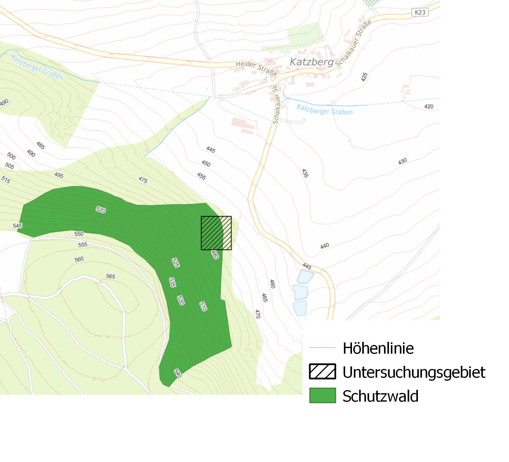
:::


::: info
Bitte starte die Conda Console und aktiviere die PDAL Umgebung bevor du mit dem Beispiel beginnst. 

   ```bash
   conda activate pdal
   ```

Wechsle anschließend mit 'cd' in das WS-Verzeichnis.
   
   ```bash
   cd c:\Users\<NAME>\Documents\PDAL
   ```
::: 

## 1. Merge 

Pipeline:
- Input: alle Dateien mit der Endung *2014.laz im WS-Verzeichnise
- Output: Datei 'merge2014.laz'

::: details Pipeline e1_merge.json
   @[code](./e1_merge.json)
:::

::: details Aufruf
```bash
      pdal pipeline e1_merge.json
```
:::

## 2. Crop

Beschneiden der Datei merge2014.laz auf die rechteckige Grenze des Untersuchungsgebietes: LL(640007;5583845), UR(640087;5583934)
    
::: details Pipeline e2_crop.json
   @[code](./e2_crop.json)
:::

::: details Aufruf
```bash
      pdal pipeline e2_crop.json
```
:::


## 3. 3D-Map View
Betrachte die Datei crop2014.laz in QGIS im 3D-Map View

::: details QGIS Karte
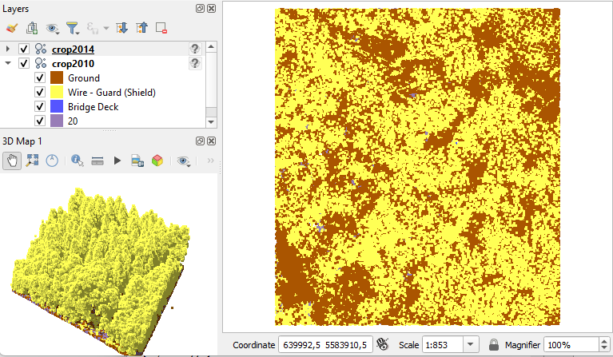
:::

<!-- Histogramm -->

## 4. Punktdichtekontrolle 

Erzeugen eines Hex-Bin Layer zur Dichtekontrolle 

a. Rufe die Hilfe zur 'pdal density' Anwendung auf
::: details
```bash
pdal density --help
```
:::

b. Erzeuge einen GeoJSON Hex-Bin Density Layer mit 5m Kantenlänge
::: details
```bash
pdal density --lyr_name density --ogrdriver GeoJSON --edge_length 5 crop2014.laz crop2014hex5.geojson
```
:::

c. Öffne QGIS und erzeuge eine 'Graduated Symbology Legend' auf dem Feld 'crop2014hex5.count' mit der Klassifizierungsmethode Natural Breaks (Jenks) und sieben Werteklassen

::: details QGIS Karte
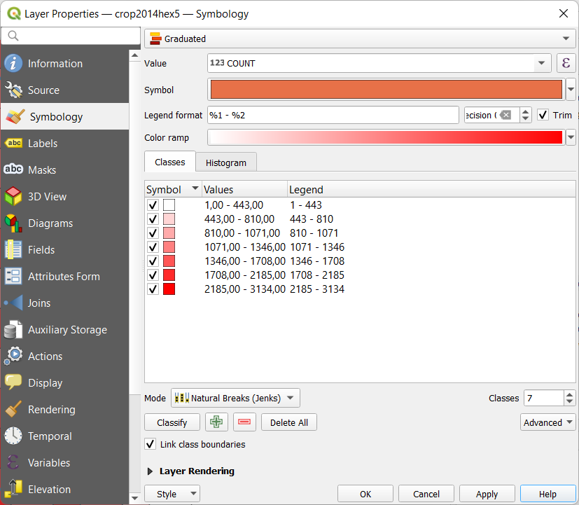
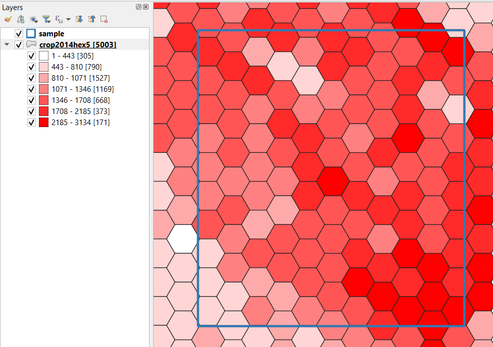
:::

## 5. Eleminieren von Ausreißern

Löschen von Punkten mit einer Höhe < 450m  

::: details Pipeline e5_outlier.json
@[code](./e5_outlier.json)
:::

::: details Aufruf
```bash
pdal pipeline e5_outlier.json
```
:::


## 6. Categorized Symbology

Lade die Datei 'classification.geojson' in QGIS und erzeuge eine 'Categorized Symbology' auf dem Feld 'name'
::: details QGIS Karte
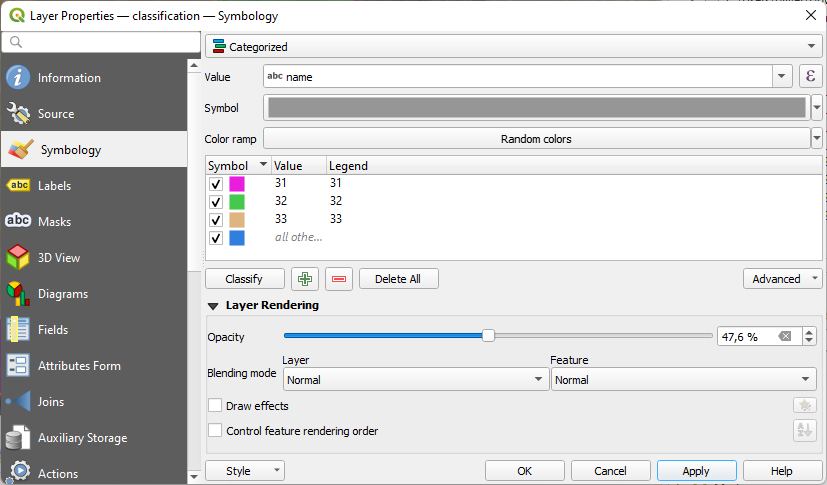
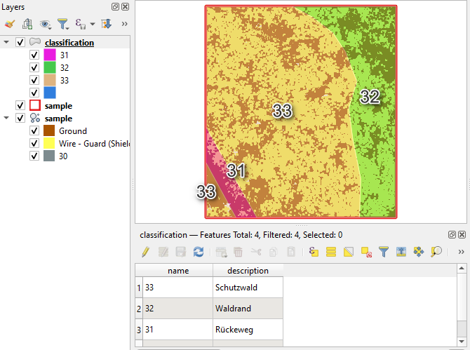
:::

## 7. Vector Overlay mit Filter

Pipeline:   
   a. Overlay von crop2014g.laz mit dem Polygon aus der Datei 'classification.geojson'   
   b. Extraktion aller Punkte innerhalb der Schutzwälder (Classification==33)

::: details Pipeline e7_overlay_expression.json
@[code](./e7_overlay_expression.json)
:::

::: details Aufruf
```bash
pdal pipeline e7_overlay_expression.json
```
::: 

c. Ergebnis in QGIS 
::: details QGIS Karte
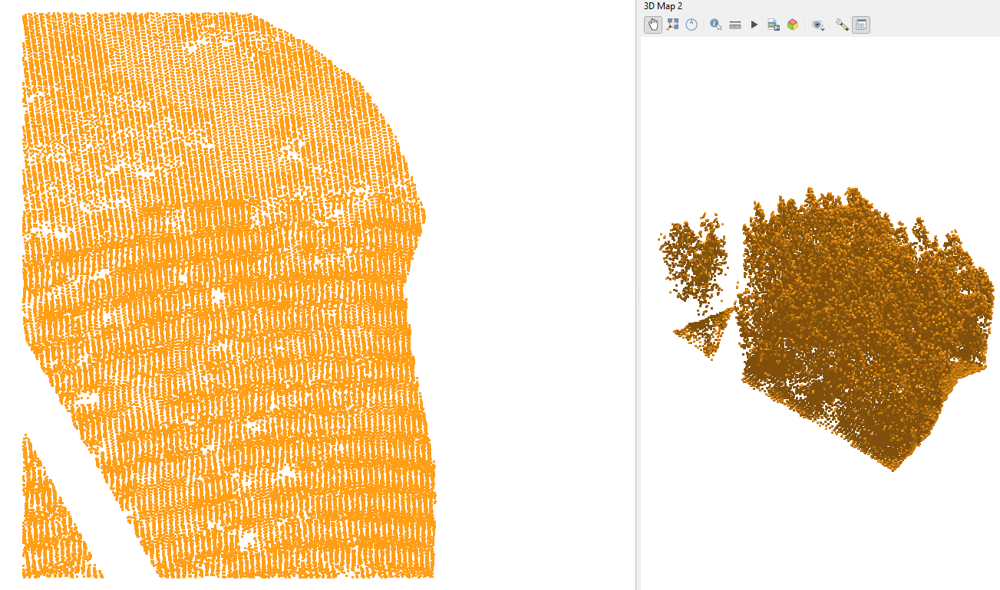
:::


## 8. Ground Klassifikation

Pipeline:  
a. Reset der Classification Dimension mit [filters.assign](https://pdal.io/en/latest/stages/filters.assign.html)  
b. Klassifizierung der Ground Points mit [filters.smrf](https://pdal.io/en/latest/stages/filters.smrf.html)  
c. Reduzieren der Ausgabepunkte auf die Ground-Points (Classification==2) mit [filters.expression](https://pdal.io/en/latest/stages/filters.smrf.html)  
d. Schreibe LAS Datei   

::: details Pipeline e8_ground.json
   @[code](./e8_ground.json)
:::

::: details Aufruf
```bash
   pda pipeline e8_ground.json
```
:::

Betrachte die Ground Datei in QGIS:
::: details Karte
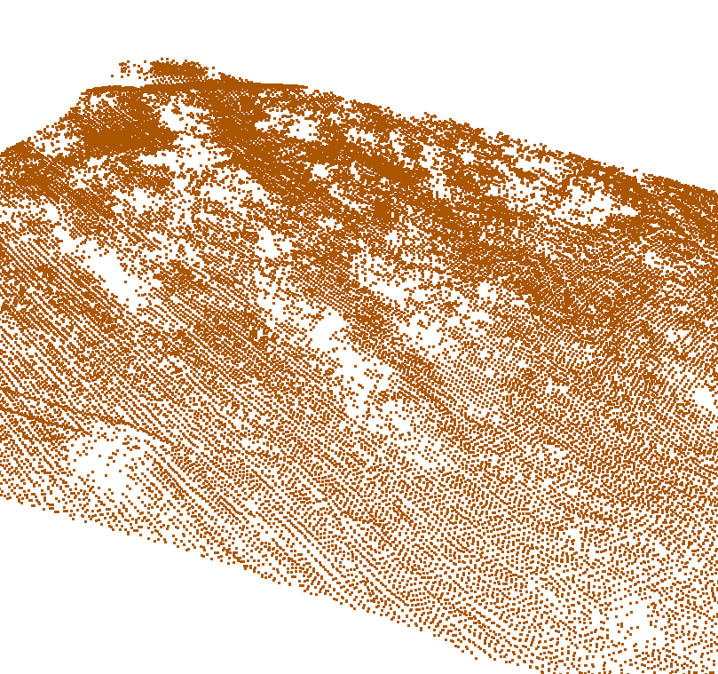
:::


## 9. DGM

### 9.1 Direkter Export 
a. GDAL Export 
::: details Aufruf
```bash
   pdal translate ground2014g.laz dgm2014.tif --writers.gdal.resolution=0.5
```
:::

b. Anzeige in QGIS
::: details Karte mit NODATA Lücken
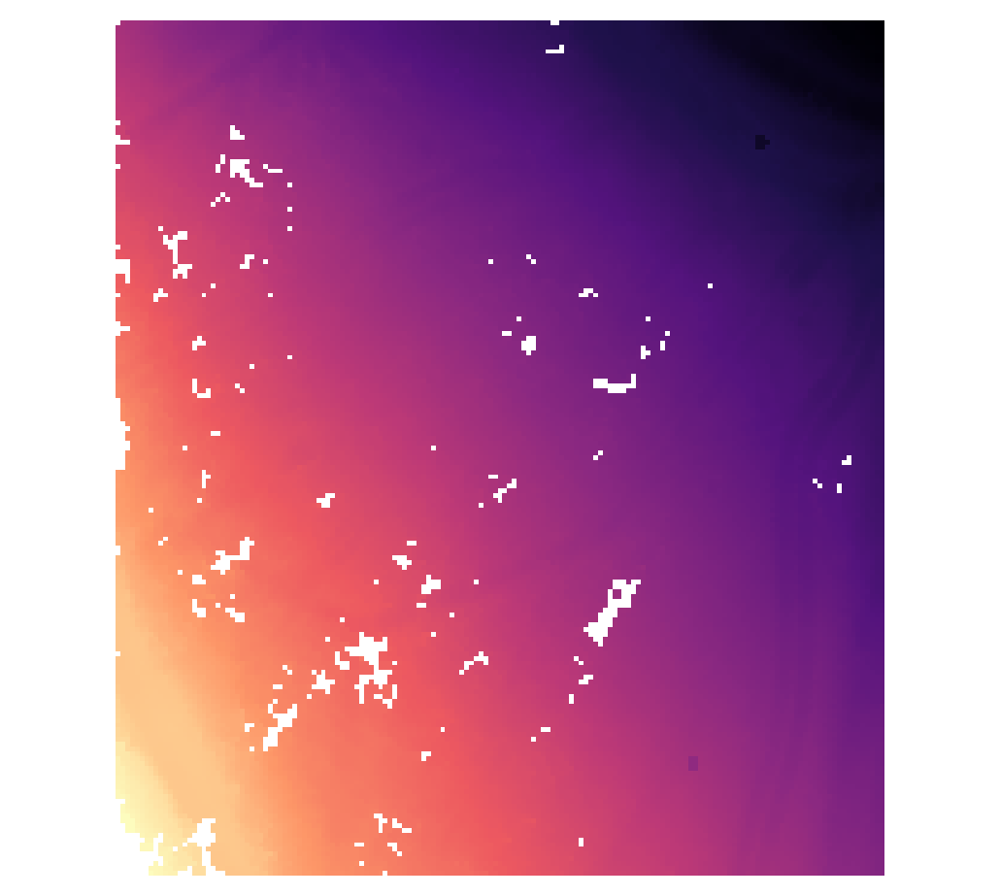
:::

c. Füllen der NODATA Werte über Interpolation in QGIS 
::: details Dialog Raster/Analysis/Fill nodata
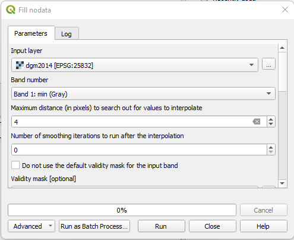
:::

d. Kontrolle in QGIS
::: details 
Karte ohne NODATA Lücken
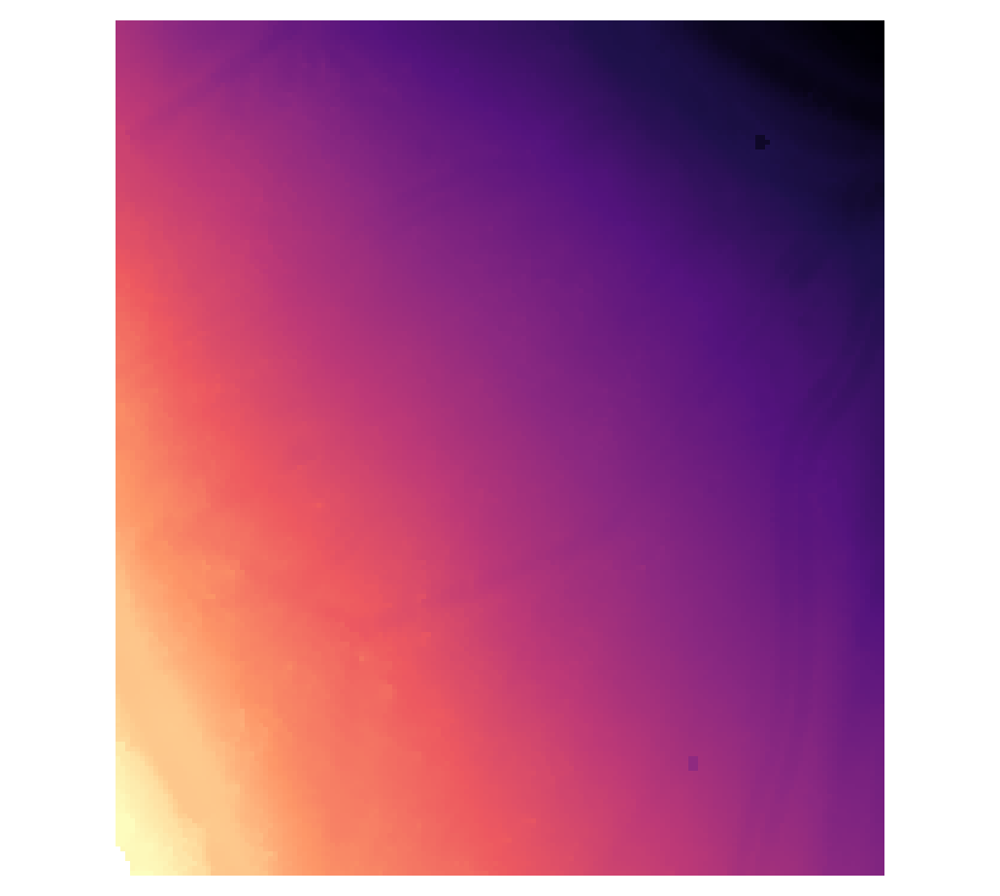

3D Map View  
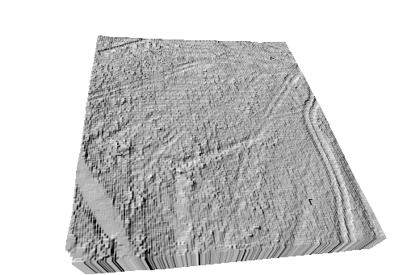
:::

### 9.2 Triangulation 

a. Pipeline aus [fiters.delaunay](https://pdal.io/en/latest/stages/filters.delaunay.html) und [filters.faceraster](https://pdal.io/en/latest/stages/filters.faceraster.html)
::: details e92_tin.json
@[code](./e92_tin.json)
:::

b. Aufruf
::: details
```bash
   pda pipeline e92_tin.json
```
:::

c. Kontrolle in QGIS
<!-- ::: details Karte 
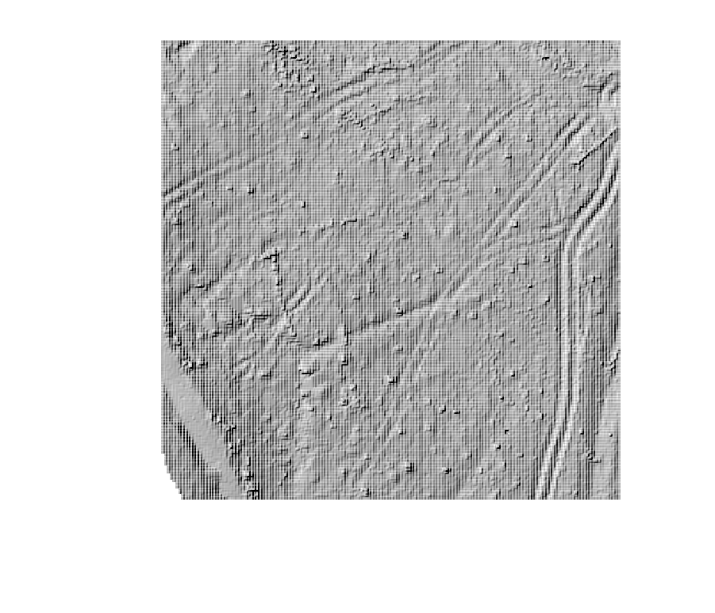
::: -->


## 10. Baum Klassifikation

a. Pipeline aus []()
::: details e10_tree.json
@[code](./e10_tree.json)
:::

b.Aufruf
::: details
```bash
pda pipeline e10_tree.json
```
:::

## 11. DOP als RGB Farbwert
<!-- a. Pipeline aus []()
::: details e11_dop.json
@[code](./e11_dop.json)
:::
b.Aufruf
::: details
```bash
pda pipeline e11_dop.json
```
::: -->