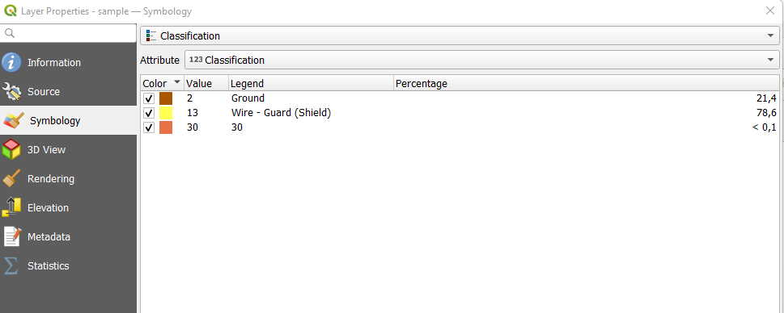
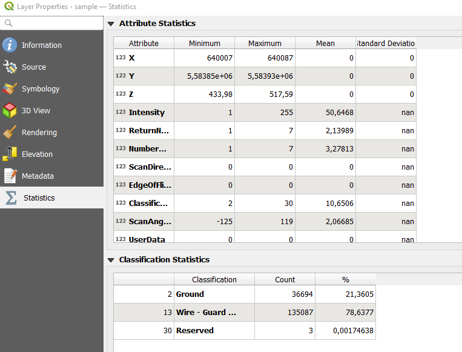
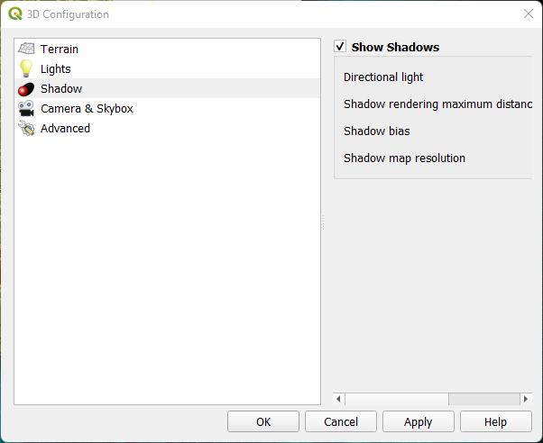
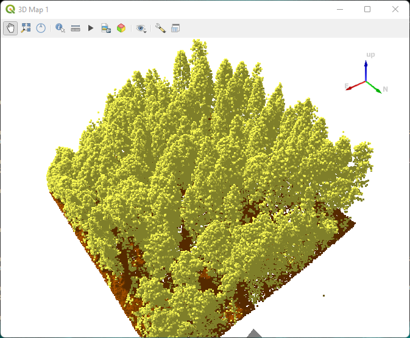

# Einführung

## 1. Software Installation

- [QGIS](https://qgis.org/de/site/forusers/download.html)
- [Visual Studio Code](https://code.visualstudio.com/Download)
- [Conda Package Management System](https://docs.conda.io/en/latest/miniconda.html)
  ```bash
  # Conda aktualisieren
  conda update conda
  # Environment anlegen
  conda create --name pdal
  # Environment anzeigen
  conda env list
  # Packages in Environment anzeigen
  conda list
  # Environment aktivieren
  conda activate pdal
  # Environment entfernen (erst am Ende des Workshops!)
  conda remove -n pdal
  ```
- [PDAL](https://pdal.io/en/latest/)
  ```bash
  # Environment aktivieren
  conda activate pdal
  # PDAL
  conda install -c conda-forge pdal python-pdal gdal
  ```

::: note
Falls es bei der Installation unter Windows ein Problem mit der OpenSSL Bibliothek gibt, hilft folgendes Vorgehen:
```bash
COPY 
 c:\Users\<USERNAME>\miniconda3\Library\bin\libcrypto-1_1-x64.dll
 c:\Users\<USERNAME>\miniconda3\Library\bin\libssl-1_1-x64.dll  
 TO
c:\Users\<USERNAME>\miniconda3\DLLs 
```
:::

## 2. Workshop Daten

Bitte entpacke die Datei [PDAL-Workshop.zip]() in ein lokales Verzeichnis

```bash 
# Vorschlag
C:\Users\<NAME>\Documents\PDAL-WS
```
Das Verzeichnis wird in der Dokumentation als __'WS-Verzeichnis'__ bezeichnet

__Datenquelle und Lizenz__

Freistaat Thüringen, Landesamt für Bodenmanagement und Geoinformation, [Geoportal-Th.de](https://www.geoportal-th.de/de-de/Downloadbereiche/Download-Offene-Geodaten-Th%C3%BCringen), bereitgestellt unter der „Datenlizenz Deutschland – Namensnennung – Version 2.0" verfügbar unter [http://www.govdata.de/dl-de/by-2-0](http://www.govdata.de/dl-de/by-2-0), zuletzt abgerufen am 16.02.2023


::: info
Die [LAS Format Definition](https://www.asprs.org/wp-content/uploads/2019/07/LAS_1_4_r15.pdf) findest du auf der Seite des ASPRS.
::: 

## 3. Visualisieren von Punktwolkendaten in QGIS
__[Working with Point Clouds](https://docs.qgis.org/3.28/en/docs/user_manual/working_with_point_clouds/point_clouds.html#)__
+ QGIS starten
+ Project als 'PDAL-WS' in WS-Ordner speichern
+ Datei sample.laz zur Karte hinzufügen
+ Layer Properties aufrufen 
+ Tab Symbology aufrufen
+ Dialog zeigt die Standard Klassifikation nach Classifaction Attribut

+ Tab: Stats aufrufen 
+ Dialog zeigt die Attribute und Classification Statistik 


__[3D Map View](https://docs.qgis.org/3.28/en/docs/user_manual/map_views/3d_map_view.html)__
+ Neue 3D Kartenansicht anlegen mit Menu 'View/3D Map Views/New 3D Map View' 
+ 3D Map View zeigt Kartenlayer 
+ Configuration öffnen 
+ Shadows aktivieren  
  
+ Zoom out  
+ 3D Map view zeigt shadows 
  

::: note
Um das Handling von großen Point Cloud Daten zu verbesseren, erzeugt QGIS beim erstmaligen Lesen einer LAS/LAZ Datei eine sog. [Cloud Optimized Point Cloud Datei](https://mapscaping.com/cloud-optimized-point-clouds-in-qgis/) mit der Endung '*.copc.laz' im Verzeichnis der Originaldatei. Sie dient als Cache und muss zur Zeit noch manuelle gelöscht werden, falls sich die Originaldatei ändert. 
::: 

