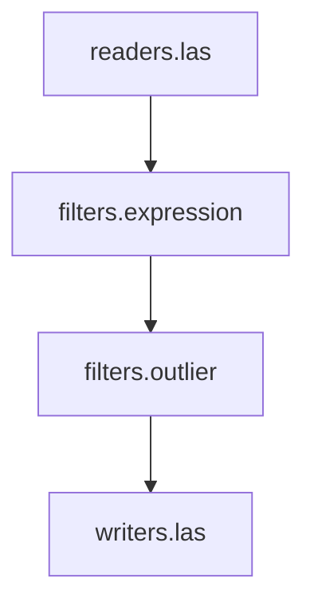

# Überblick

## Bestandteile

### Pipeline

Pipelines bestehen aus _Stages_ und definieren einen Datenfluss aus _Dimensions_. Sie besitzen mindestens eine Reader- und eine Writer-Stage. 


Pipelines sind z. B. über die Anwendung ``pdal pipeline`` ausführbar.

### Stages

Stages sind ein Überbegriff für Elemente in einer Pipeline.

PDAL unterscheidet die folgenden drei Typen:

  - **Reader**:
  Reader lesen Dimensions und erzeugen einen Datenfluss aus Dimensions. Sie stehen üblicherweise am Anfang einer Pipeline.  
  Beispiel: [readers.las](https://pdal.io/en/latest/stages/readers.las.html#readers-las), [readers.txt](https://pdal.io/en/latest/stages/readers.text.html#readers-text), [readers.gdal](https://pdal.io/en/latest/stages/readers.gdal.html#readers-gdal)

  - **Writer**:
  Writer konsumieren Dimensions aus dem Datenfluss und schreiben ihre Daten in die Ausgabe. Writer stehen deswegen am Ende der Pipeline.   
  Beispiel: [writer.las](https://pdal.io/en/latest/stages/writers.las.html),[writers.raster](https://pdal.io/en/latest/stages/writers.raster.html)

  - **Filter**:
  Filter arbeiten mit Daten als sog. Inline-Operationen im Datenfluss. Einige Filter können nur mit bestimmten Dimensionen arbeiten, z. B. kann 'filters.reprojection' nur XYZ-Koordinaten reprojezieren.   
  Beispiel: [filters.expression](https://pdal.io/en/latest/stages/filters.expression.html), [filters.reprojection](https://pdal.io/en/latest/stages/filters.reprojection.html)

### Dimensions

Dimensionen besitzen einen _Namen_ und einen _Datentyp_. Sie werden zwischen Stages über den Datenfluss ausgetauscht. Ihr Datentyp wird zur Laufzeit bestimmt. Es ist ein Standarddatentyp für jede Dimension vorhanden.

**Beispiel**: X(double), Y(double), Z(double), HeightAboveGround(double), Intensity(uint16)

::: info
Die Definition der Default Dimensions ist Teil der [LAS-Format Specification](https://www.asprs.org/wp-content/uploads/2019/07/LAS_1_4_r15.pdf) 
::: 

## Beispiel Pipeline


```json
[
  "input.laz",
  { "type": "filters.expression",
    "expression": "(Z>=10 && Z<50)"
  },
  { "type": "filters.outlier",
    "method": "radius", //
    "radius": 1.0, // Distanz in Map Units
    "min_k": 4 // Mindestanzahl von Nachbarn
  },
  "output.laz"
]
```

## Implementierungen

- Language Binding

  - [C++](https://pdal.io/en/latest/api/cpp/index.html)
  - [Python](https://pypi.org/project/pdal/)
  - [Java](https://pdal.io/en/latest/java.html)

- [CLI Anwendungen](https://pdal.io/en/latest/apps/index.html)


## Referenzen

+ [PDAL Homepage](https://pdal.io/en/latest/)
+ [PDAL Workshop](https://pdal.io/en/latest/workshop/index.html)
+ [PDAL Tutorial](https://pdal.io/en/latest/tutorial/index.html)
+ Butler, H. Chambers, B. Hartzell, P. Glennie, C. PDAL: An open source library for the processing and analysis of point clouds. Computers & Geosciences, Volume 148, 2021, 104680, ISSN 0098-3004, [https://doi.org/10.1016/j.cageo.2020.104680](https://doi.org/10.1016/j.cageo.2020.104680)

