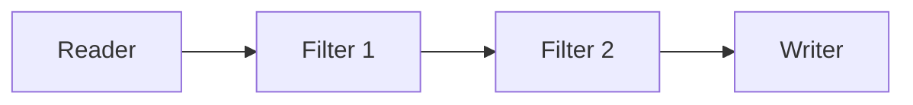

# Überblick

<!-- ## Historie

| Datum   | Beschreibung                                              |
| ------- | --------------------------------------------------------- |
| 2011/04 | Howard Butlers erster Commit auf [GitHub](http://pdal.io) |
| 2021/02 | Integration in QGIS 3.18                                  |
| 2023/02 | Version 2.5.1 mit 135 Beitragenden und 900 GitHub Sternen |
| 2023/03 | Verbesserte Integration ab QGIS 3.30                      | -->

<!-- ## Abgrenzung zu anderen Bibliotheken
//TBD -->

## Bestandteile aus konzeptioneller Sicht

### Dimensions

Alle PDAL Punktdaten werden als ein Menge von Dimensionen gespeichert. Dimensionen besitzen einen Namen und einen Datentyp. Der Datentyp wird zur Laufzeit bestimmt, es ist jedoch ein Standarddatentyp für jede Dimension vorhanden.

__Beispiel__: X(double), Y(double), Z(double), Intensity(uint16), ReturnNumber(uint8), HeightAboveGround(double), Intensity(uint16)

### Stages

Stages sind ein Überbegriff für Elemente in einer Pipeline. PDAL kennt zwei unterschiedliche Modi beim Starten einer Stage:

- **Standard**: Input Daten werden vollständigen in den RAM gelesen, bevor die Stage gestartet wird
- **Stream**: Input Daten werden in Junks gelesen und an die Stage übergeben

PDAL unterscheidet die folgenden Stage Typen:

**Reader**:
Reader lesen Dimensions und erzeugen einen Dataflow. Sie stehen überlicherweise am Anfang einer Pipeline. 

Beispiel: [readers.las](https://pdal.io/en/latest/stages/readers.las.html#readers-las), [readers.txt](https://pdal.io/en/latest/stages/readers.text.html#readers-text), [readers.gdal](https://pdal.io/en/latest/stages/readers.gdal.html#readers-gdal)

**Writer**:
Writer konsumieren Daten aus dem Data-Flow und Schreiben ihre Daten in eine Ausgabe. Writer stehen deswegen am Ende des Data-Flows.

Beispiel: [writer.las](https://pdal.io/en/latest/stages/writers.las.html),[writers.raster](https://pdal.io/en/latest/stages/writers.raster.html)

**Filter**:
Filter arbeiten mit Daten als sog. Inline-Operationen im Data-Flow. Einige Filter können nur mit bestimmten Dimensionen arbeiten, z. B. kann 'filters.reprojection' nur XYZ-Koordinaten reprojezieren. 

### Pipeline

Eine Pipeline besteht aus unterschiedlichen Stage-Elementen. Die Elemente sind über einen Data-Flow miteinander verbunden:

Pipelines sind z.B. über die Anwendung pdal pipeline ausführbar. 

::: note
Mit der zunehmenden Integration von PDAL in die QGIS Umgebung werden die PDAL-Funktionen auch in QGIS verfügbar und lassen sich mit Tools wie dem 'Graphical Modeler' zu einem ausführbaren Workflow kombinieren.
:::

## Implementierungen

- Language Binding ([C++](https://pdal.io/en/latest/api/cpp/index.html),[Python](https://pypi.org/project/pdal/),[Java](https://pdal.io/en/latest/java.html))
- [CLI Anwendungen](https://pdal.io/en/latest/apps/index.html)
